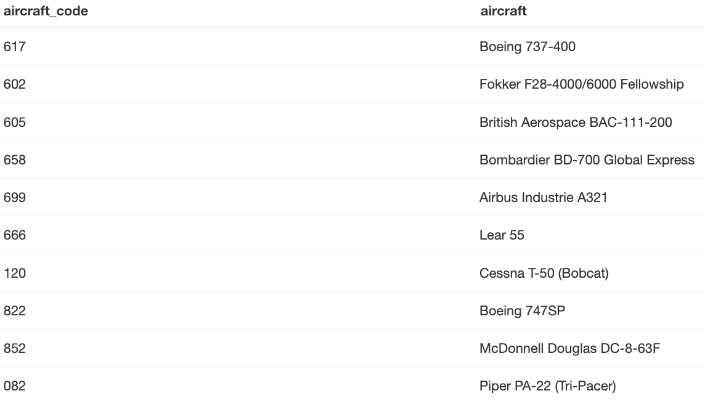

# Redshift_Flight_Analysis

## 1. Introduction

This project explores historical domestic flight data in the United States, spanning over two decades. The dataset originates from the [U.S. Bureau of Transportation Statistics](https://www.bts.gov/) and provides detailed records of flight activity from 1990 to 2012. 

The data includes:
- A total of **96 million+ flight records**
- **23 CSV files**, each corresponding to one year between 1990 and 2012
- Approximately **6 GB** of raw data
- **GZIP compression** reduces the storage requirement to just **700 MB**

This dataset offers a robust foundation for analyzing trends in air travel, airline operations, and airport performance over time.

## 2. Data Dictionary

### 🛫 Main Flight Table

| Column          | Example Value           | Description                                             |
|-----------------|-------------------------|---------------------------------------------------------|
| `year`          | 1997                    | Calendar year of the flight                             |
| `month`         | 3                       | Month of the year                                       |
| `day`           | 25                      | Day of the month                                        |
| `carrier`       | United Air Lines Inc.   | Name of the operating airline                           |
| `origin`        | SEA                     | Departure airport code                                  |
| `dest`          | SFO                     | Destination airport code                                |
| `aircraft_code` | 616                     | Aircraft identifier                                     |
| `miles`         | 678                     | Distance flown between cities (in miles)                |
| `departures`    | 11                      | Number of scheduled departures for that day             |
| `minutes`       | 1109                    | Total airborne minutes for all flights that day         |
| `seats`         | 1188                    | Combined number of available seats                      |
| `passengers`    | 848                     | Total passengers transported                            |
| `freight_pounds`| 3335                    | Freight carried (in pounds)                             |

### ✈️ Aircraft Lookup Table

This table links aircraft codes to specific aircraft names:

| Column          | Description                         |
|-----------------|-------------------------------------|
| `aircraft_code` | Aircraft identifier (numeric)       |
| `aircraft`      | Name/type of the aircraft           |

### 🛬 Airport Lookup Table

This table provides mappings between airport codes and airport names:

| Column         | Description                          |
|----------------|--------------------------------------|
| `airport_code` | Abbreviated airport identifier       |
| `airport`      | Full name of the airport             |

## 3. Data Source

- **s3 location**: can be found under the Source section below
- **delimiter**: `/`

## 4. Launching Redshift Cluster

To launch an Amazon Redshift cluster, follow these steps:
1. Go to the AWS Management Console.
2. Navigate to Redshift and select **Create Cluster**.
3. Configure your cluster (e.g., node type, database name, master username/password).
4. Launch the cluster and wait for it to become available.

I used 2 nodes of dc2.large type cluster.

## 5. Connecting to Redshift via Postrgre

Connect to the REdshift's endpoint via pgweb on EC2


## 6. Queries

Start by defining a schema: first, run a query to create the table, 

```sql
CREATE TABLE flights (
  year           smallint,
  month          smallint,
  day            smallint,
  carrier        varchar(80) DISTKEY,
  origin         char(3),
  dest           char(3),
  aircraft_code  char(3),
  miles          int,
  departures     int,
  minutes        int,
  seats          int,
  passengers     int,
  freight_pounds int
);

```


```sql
CREATE TABLE aircraft (
  aircraft_code CHAR(3) SORTKEY,
  aircraft      VARCHAR(100)
);
```

```sql
CREATE TABLE airports (
  airport_code CHAR(3) SORTKEY,
  airport      varchar(100)
);
```

then load the data using the command below.

```sql
COPY flights
FROM 's3://us-west-2-aws-training/courses/spl-17/v4.2.17.prod-287e4e43/data/flights-usa'
IAM_ROLE '<your-redshift-iam-arn>'
GZIP
DELIMITER ','
REMOVEQUOTES
REGION 'us-west-2';
```

```sql
COPY aircraft
FROM 's3://us-west-2-aws-training/courses/spl-17/v4.2.17.prod-287e4e43/data/lookup_aircraft.csv'
IAM_ROLE '<your-redshift-iam-arn>'
IGNOREHEADER 1
DELIMITER ','
REMOVEQUOTES
TRUNCATECOLUMNS
REGION 'us-west-2';

```

```sql
COPY airports
FROM 's3://us-west-2-aws-training/courses/spl-17/v4.2.17.prod-287e4e43/data/lookup_airports.csv'
IAM_ROLE '<your-redshift-iam-arn>'
IGNOREHEADER 1
DELIMITER ','
REMOVEQUOTES
TRUNCATECOLUMNS
REGION 'us-west-2';
```

### 6.1. Display a random sample of 10 rows from the dataset  

```sql
select * from flights order by random() limit 10;
```


```sql
select * from aircraft order by random() limit 10;
```



```sql
select * from airports order by random() limit 10;
```


### 6.2. Identify the 10 airlines with the most departures  

```sql
select carrier, sum(departures) as "total departures" from flights group by carrier order by 2 DESC LIMIT 10;
```


### 6.3. Find the top 3 airlines that transported the most passengers 

```sql
select carrier, sum(passengers) as "total passangers" from flights group by 1 order by 2 DESC limit 3;
```


### 6.4. Determine the top 3 carriers based on total miles flown  

```sql
select carrier, sum(miles) as "total miles" from flights group by 1 order by 2 DESC limit 3;
```


### 6.5. Rank the top 3 airlines by total passenger-miles (passengers × distance) 

```sql
select carrier, sum(miles * passengers) as "total miles x passengers" from flights group by 1 order by 2 DESC limit 3;
```


### 6.6. Reveal the top 3 airlines by freight volume  

```sql
select carrier, sum(freight_pounds) as "total freights" from flights group by 1 order by 2 DESC limit 3;
```


### 6.7. List the aircraft types that have flown the most

```sql
select aircraft, sum(departures) as "total_departures" from aircraft a
join flights f 
on a.aircraft_code = f.aircraft_code
group by 1
order by 2 DESC
limit 5;
```


### 6.7. List the aircraft types that have flown the most

### Create a table that shows fligt to Las Vegas Airport

```sql
CREATE TABLE vegas_flights
  DISTKEY (origin)
  SORTKEY (origin)
AS
SELECT
  flights.*,
  airport
FROM flights
JOIN airports ON origin = airport_code
WHERE dest = 'LAS';
```


### Find out which cities most of the popular flights to Las Vegas come from.

```sql
Select origin, to_char(sum(departures), '999,999,999') from vegas_flights group by 1 order by 2 desc limit 10;
```


## 7. Source

- **Dataset**: Main dataset provided by [BTS.gov](https://www.bts.gov/) is used strictly for educational purposes.
Note: You need to have an IAM access from AWS in order to achieve it.

- Main flight data:  
  `s3://us-west-2-aws-training/courses/spl-17/v4.2.17.prod-287e4e43/data/flights-usa`

- Aircraft reference table:  
  `s3://us-west-2-aws-training/courses/spl-17/v4.2.17.prod-287e4e43/data/lookup_aircraft.csv`

- Airport reference table:  
  `s3://us-west-2-aws-training/courses/spl-17/v4.2.17.prod-287e4e43/data/lookup_airports.csv`
  
- **Resource**: Working with Amazon Redshift, AWS (2025). https://explore.skillbuilder.aws/learn/course/internal/view/elearning/410/working-with-amazon-redshift
